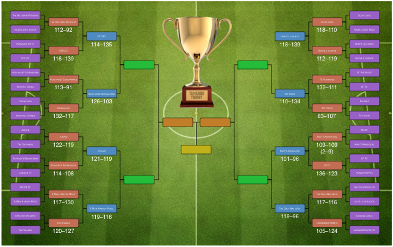

# C3 Fantasy Football---Tamarind Trophy 2014/15
This year there are 55 teams in the league. Therefore the cup draw will be as
follows so as to include all teams. The top 9 teams after gameweek 18 will be
granted free passage into the second round equally spaced on the road to the
final. The remaining 46 teams will be randomly entered into the first round.

The winning team will received an inscribed, much coveted,  **Tamarind Trophy**
and a **£30 Amazon Gift Voucher**.

## Wallchart
Click image to see full size...

## Rules
* The cup will start on **Gameweek 20** (Jan 1st);
* The cup will last for **10 gameweeks**;
* The cup consists of **5 rounds**;
* Each round will be **2 gameweeks**;
* A team's score for the round will be the **sum of their team's points** for
  **both gameweeks**;
* The team with the **highest round score** will progress to the next round;
* In the case of a tie, the round will be decided on the sum of the points
  scored by the **benched players** across both gameweeks.

## Previous winners
* 2013-14: Sam Buxton with _How hard? Gerraarrrd_

