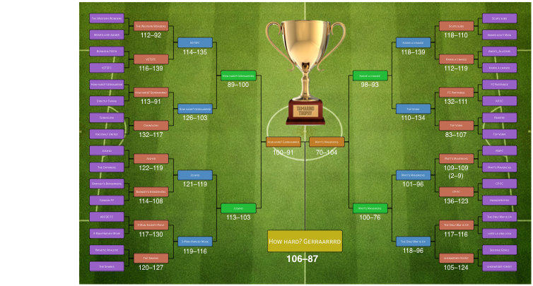

# C3 Fantasy Football---Tamarind Trophy 2013/14
The top 32 teams as of gameweek 18 in the C3 FFL league have been entered into
the prestigious, 5-round knock-out cup for the Tamarind Trophy.

The winning team will received an inscribed, much coveted,  **Tamarind Trophy**
and a **£30 Amazon Gift Voucher**.

## We have a winner!
Congratulations to **Sam Buxton** and his team **How hard? Gerraarrrd** for
their impressive and relentless climb to the top!

## Wallchart
Click image to see full size...

## Rules
* The cup will start on **Gameweek 20** (Jan 1st);
* The cup will last for **10 gameweeks**;
* The cup consists of **5 rounds**;
* Each round will be **2 gameweeks**;
* A team's score for the round will be the **sum of their team's points** for
  **both gameweeks**;
* The team with the **highest round score** will progress to the next round;
* In the case of a tie, the round will be decided on the sum of the points
  scored by the **benched players** across both gameweeks.
